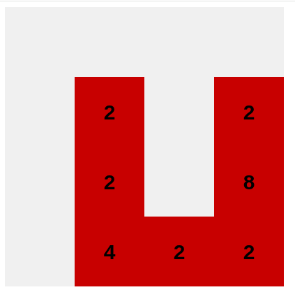

# 2048-game
> This project is a simple browser game in the style of 2048, implemented in pure JavaScript.

## [Click to Play](https://antilopinae.github.io/2048-game/)
> Simple game cycle logic with updating and rendering

## Screenshots

## License
This project is distributed under the [MIT license](LICENSE).
